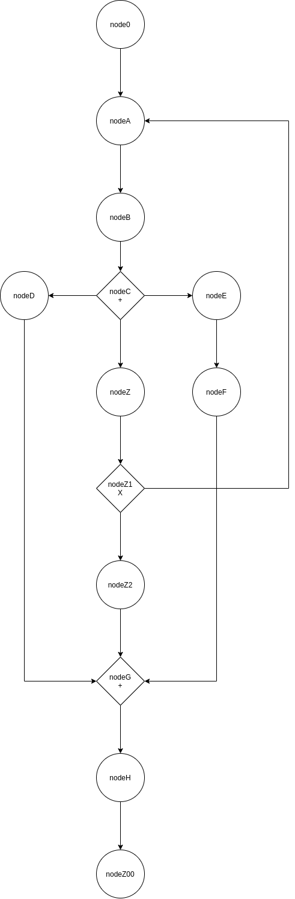

## A simple javascript simulator using events
This simulator is simulating a business process. 
We have parallel and exclusive gateway nodes. [More info](https://www.lucidchart.com/pages/bpmn-gateway-types)

## The picture of the process


## how to run
`npm i` <br>
`node orchestrator.js`

## Challenge
1. when running a loopback the number of times the **end** node is called is greater than the number of rounds. This is a bug as the number end counter should be equal to number of rounds. 
This bug only appears when we have a loopback in place. 
To create a loopback, change these probabilities from
```
	linkNode({ fromId: nodeZ1, toId: nodeZ2, probability: 1 })
	linkNode({ fromId: nodeZ1, toId: nodeA, probability: 0 })
```
to 
```
	linkNode({ fromId: nodeZ1, toId: nodeZ2, probability: 0.1 })
	linkNode({ fromId: nodeZ1, toId: nodeA, probability: 0.9 })   // tells to loopback to nodeA. see image reference
```
in file `main.js`

the actual output should be this
```
end counter:  3 round:  3 node name:  Z00
end counter:  4 round:  4 node name:  Z00
```

however, upon running with the modified probabilities above, we get results like these
```
end counter:  6 round:  1 node name:  Z00
end counter:  7 round:  1 node name:  Z00
```
Clearly the end node is being invoked more times than the number of rounds, which tells us that the loopback is somehow causing duplicate invokations. 
Can you figure out how to solve this so that `endCounter === rounds`

Inspired by [bpsimulator](https://www.bpsimulator.com/run/)